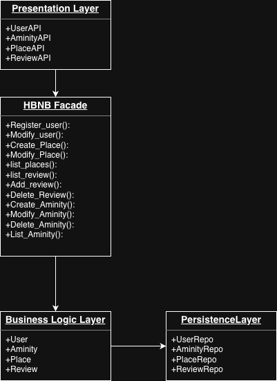
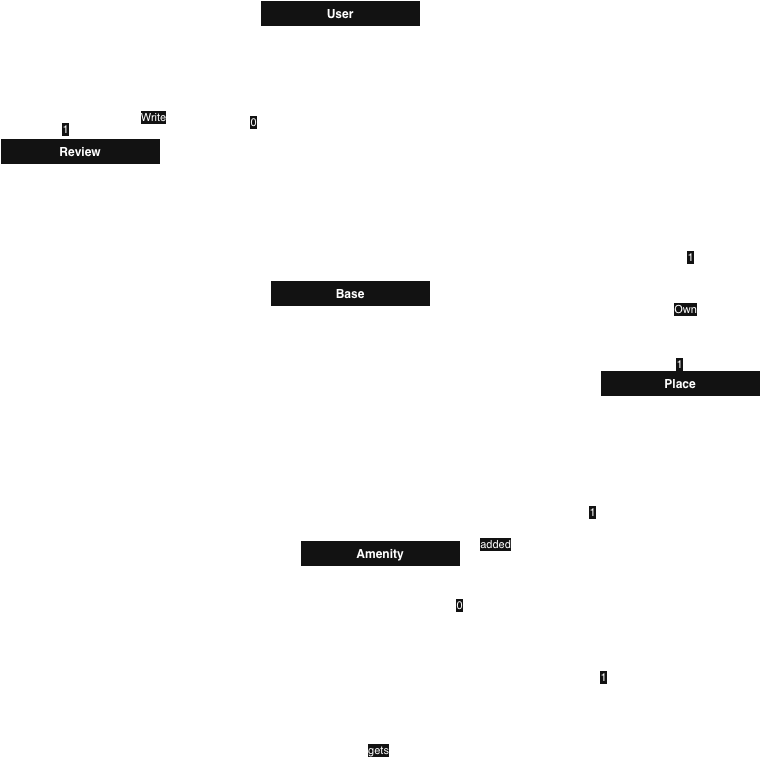
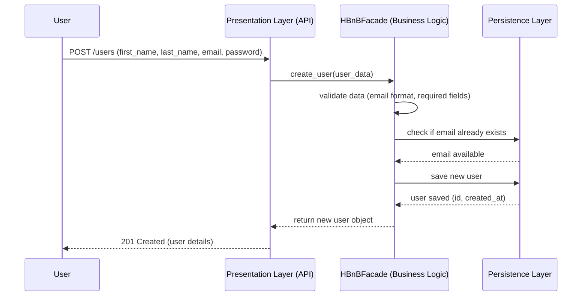
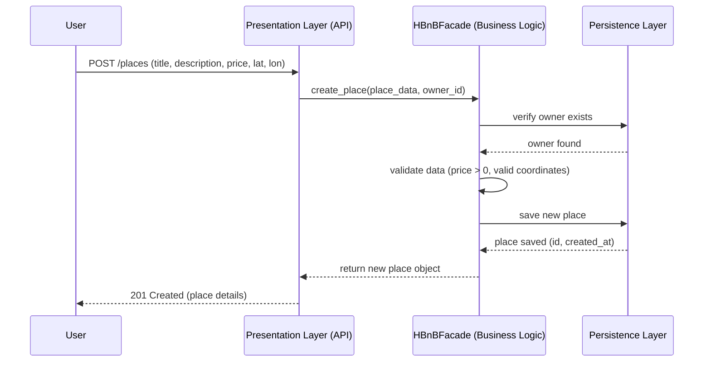
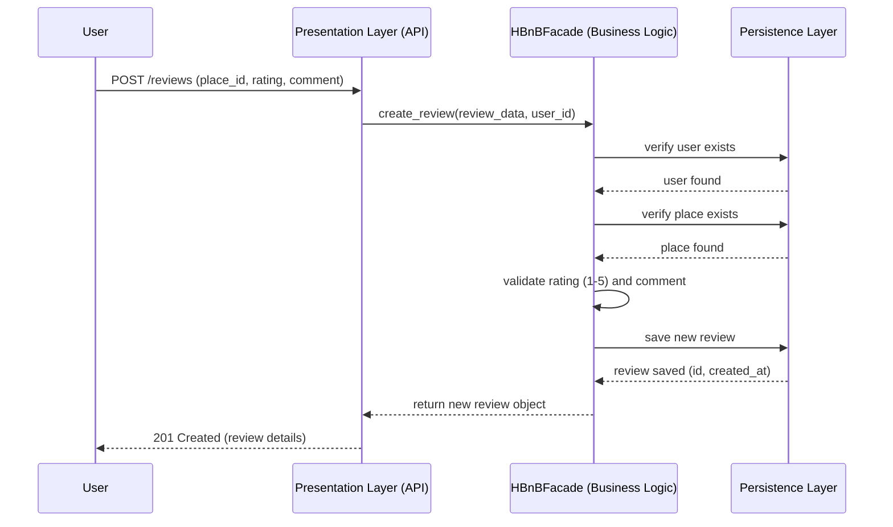
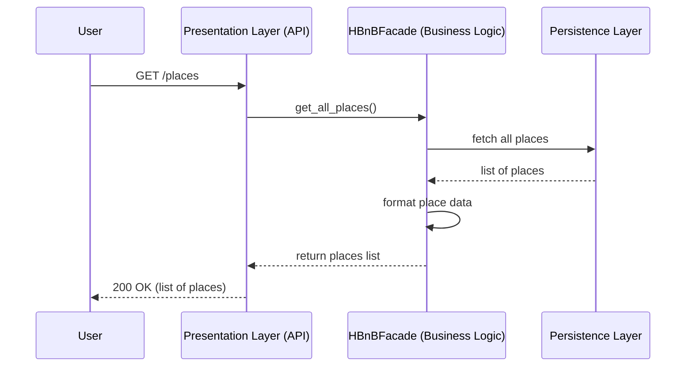

# HBnB Evolution — Technical Documentation (Part 1)

## Authors
Ahmed Ahmed, Alzara Abdullah, Alatar Saad

---

## 1. Introduction

HBnB Evolution is a simplified AirBnB-like application that allows users to
register, list places, leave reviews, and manage amenities.

This document compiles the complete technical design of the application:
the high-level architecture, the detailed design of the Business Logic
layer, and the interaction flow between layers for the main API calls.
It serves as the blueprint that will guide the implementation phases in
Parts 2 and 3 of the project.

---

## 2. High-Level Architecture

The application follows a **three-layer architecture**:

**Presentation Layer**: Handles all interaction between users and the
application. It exposes the API endpoints (users, places, reviews,
amenities) and forwards requests to the Business Logic layer. It contains
no business rules itself.

**Business Logic Layer**: The core of the application. It contains the
main models (User, Place, Review, Amenity) and enforces all business
rules, such as validating data before saving.

**Persistence Layer**: Responsible for storing and retrieving data. It
contains the repositories that communicate directly with the database
(the database itself will be implemented in Part 3).

**Facade Pattern**: All communication between the Presentation layer and
the Business Logic layer goes through a single unified interface (the
Facade). This keeps the layers loosely coupled: if the internal logic
changes, the API does not need to change, because it only talks to the
facade. It also gives the diagram a single, clear communication pathway
between layers.

---

## 3. Business Logic Layer

**BaseModel**: A parent class holding the attributes shared by all
entities: a unique identifier (UUID4) and creation/update timestamps for
audit purposes. All four entities inherit from it, which avoids
duplication (DRY principle).

**User**: Represents a person using the application. Key attributes:
first name, last name, email, and a private password. The `is_admin`
boolean distinguishes administrators from regular users. Users can
register, update their profile, and be deleted.

**Place**: Represents a property listed by a user. It stores the title,
description, price, and location (latitude/longitude). Each place is
owned by exactly one user, while a user can own many places.

**Review**: Feedback left by a user on a place, containing a rating and
a comment. A review cannot exist without its place, so the Place–Review
relationship is a composition: deleting a place deletes its reviews.

**Amenity**: A feature a place can offer (e.g., Wi-Fi, pool). The
Place–Amenity relationship is many-to-many: one place can have several
amenities, and one amenity can belong to several places.

**Relationships summary**: All entities inherit from BaseModel
(generalization). User is associated with Place (ownership) and Review
(authorship). Place is composed of Reviews and aggregates Amenities.
Multiplicity on each relationship reflects the business rules above.

---

## 4. API Interaction Flow

The following sequence diagrams show how the three layers cooperate to
handle the four main API calls. In every flow the request follows the
same path — API → Facade → Database — and the response returns through
the same path in reverse. No layer is ever skipped.

### 4.1 User Registration

A user signs up by sending their data to the API. The Facade validates
the data, checks that the email is not already used, then saves the user.

### 4.2 Place Creation

A user creates a new place listing. The Facade verifies the owner exists
and validates the data (price, coordinates) before saving.

### 4.3 Review Submission

A user submits a review for a place. The Facade verifies that both the
user and the place exist, then validates the rating before saving.

### 4.4 Fetching a List of Places

A user requests the list of available places. The Facade retrieves all
places from the database and returns them formatted to the API.

---

## 5. Conclusion

This documentation defines the complete design of HBnB Evolution: a
three-layer architecture connected through the facade pattern, four core
entities sharing a common BaseModel, and consistent request flows across
all API calls. It will serve as the reference blueprint for the
implementation in Parts 2 and 3.
