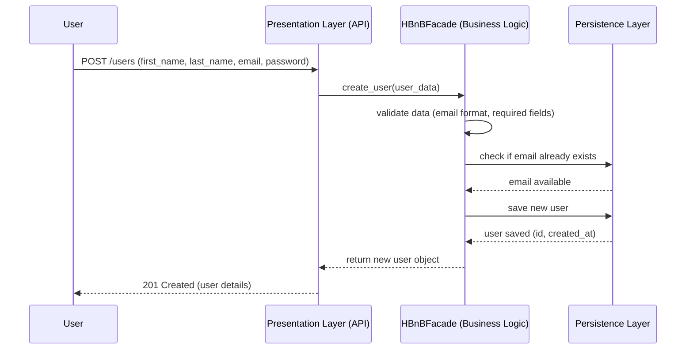
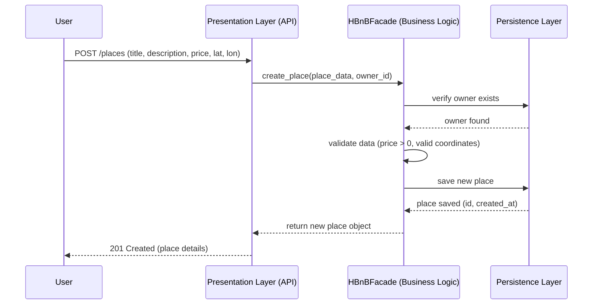
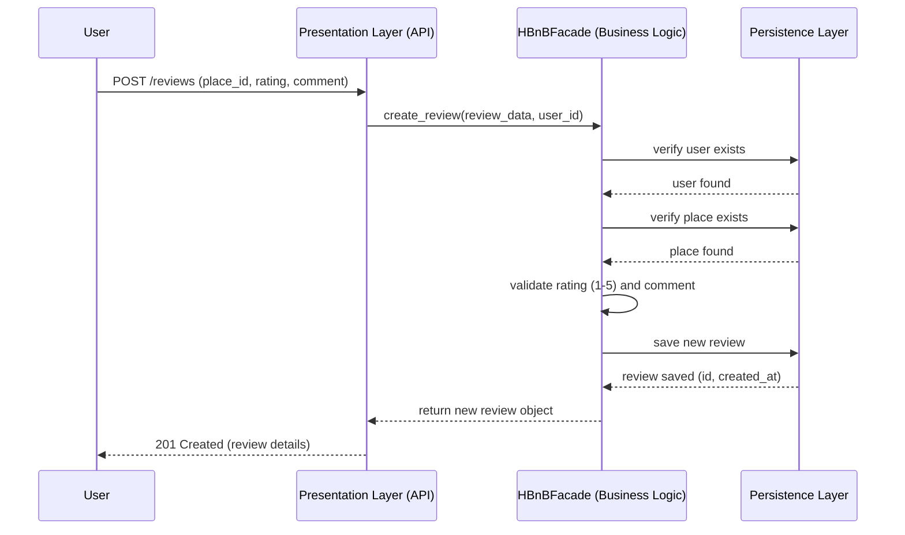
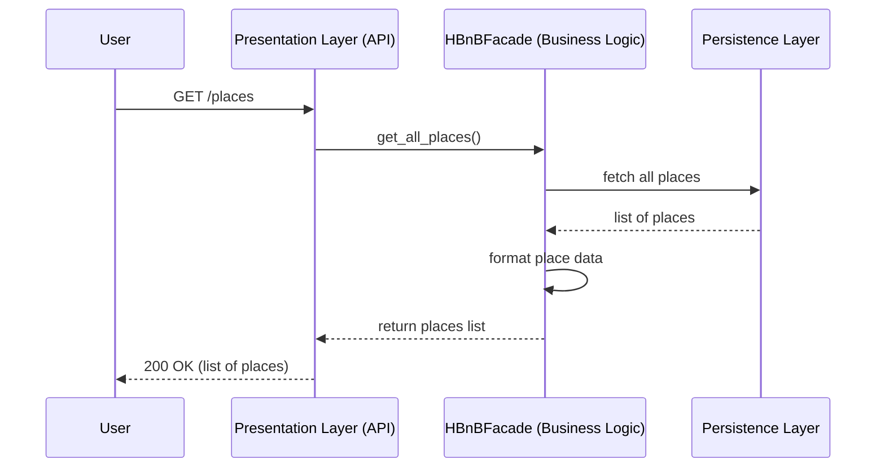

# Sequence Diagrams for API Calls

This document contains four sequence diagrams showing how the three layers
(Presentation, Business Logic, Persistence) interact to handle API requests.

## 1. User Registration

A user signs up by sending their data to the API. The Facade validates the
data, checks that the email is not already used, then saves the new user.

## 2. Place Creation

A user creates a new place listing. The Facade verifies the owner exists
and validates the data (price, coordinates) before saving.

## 3. Review Submission

A user submits a review for a place. The Facade verifies that both the
user and the place exist, then validates the rating before saving.

## 4. Fetching a List of Places

A user requests the list of available places. The Facade retrieves all
places from the database and returns them formatted to the API.

## Summary

In all four flows, the request always follows the same path:
API → Facade → Database, and the response returns through the same path
in reverse. No layer is ever skipped, which reflects the layered
architecture and the facade pattern described in the package diagram.
